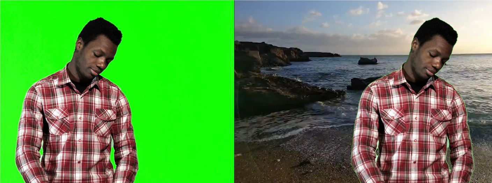

# GSoC'2022 with FFmpeg
<!-- two pictures with each other -->

    

    

## Project Information:
### Project Name: [Accelerate Video filters using CUDA C++](https://summerofcode.withgoogle.com/programs/2022/projects/ufW321cw)
#### Mentor: [Timo Rothenpieler](https://github.com/BtbN) Student: [Mohamed Khaled](https://github.com/MohamedElhadidy0019)

## Project Description:
FFmpeg has filters that are impleemtned in C, but most of them can be much faster if implemented in CUDA C++ and harvesting the poewr of the gpu. Even there are filters that are not efficient to run on the CPU as it will take LONG run time so running in them on the GPU is way more conveneint. The goal of this project is to implement some of the filters in CUDA C++ and make them run faster than the C implementation.

## Work Done:
-[Chroma Key CUDA Filter (Merged)](https://github.com/FFmpeg/FFmpeg/commit/b1648150b2fdd1e4dba9fc05d08ee6fea13798c9)
Parallelising the existing chorma key filter in CUDA C++, this filter takes a base video and changes the alpha cannel of the pixels that are in the range of the chroma key color entered by the user and then the user can add a background video to the base video.
As this was my first filter it took me a while at first in order to understand FFmpeg code base and how to use its build tools/scripts and understand/handle different video foramts like YUV420,YUV444 and nv12.
[Filter Documentation](https://www.ffmpeg.org/ffmpeg-filters.html#chromakey_005fcuda)

    

filter input left, filter output right

  
  

-[Bilateral CUDA Filter (Merged)](https://github.com/FFmpeg/FFmpeg/commit/1a5cd79f518268203c4fff7c664b387e5720f1f4)
This is an edge preserving blurring filter, unlike gaussian blur that only depends on the spatial distance between the pixel and its neigbours, this filter also depends on the color distance.
This filter was very tricky to implement as the C implemenation was an approximation to the filter so I had to implement the filter from scratch by reading research papers, searching for the algorithm and implementing it in CUDA C++. There are links for all the material that helped me implement that filter at the end of this report.

    

filter input left, filter output right

  
  

### All My Commits:
- Chroma Key CUDA Filter: https://github.com/FFmpeg/FFmpeg/commit/b1648150b2fdd1e4dba9fc05d08ee6fea13798c9
- Bilateral CUDA Filter: https://github.com/FFmpeg/FFmpeg/commit/1a5cd79f518268203c4fff7c664b387e5720f1f4

### Resources for Bilateral Filter:
- [Bilateral Filter Paper](https://www.cs.jhu.edu/~misha/ReadingSeminar/Papers/Tomasi98.pdf) This paper was very helpful in understanding the filter and the maths behind it.
- [Stack Overflow Question](https://stackoverflow.com/questions/5000665/bilateral-filtering-with-color) This question helped me understand that color spaces matter in the filter implemenation.
- [Professor Keenan Crane's Color Lecture](https://www.youtube.com/watch?v=77WBg0Mprt0&t=2s&ab_channel=KeenanCrane) This lecture really taught me alot about color spaces and their characteristics and based on than lecture I decided to use the YUV color space knowing that it is suitable for that filter.

